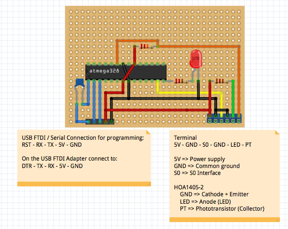
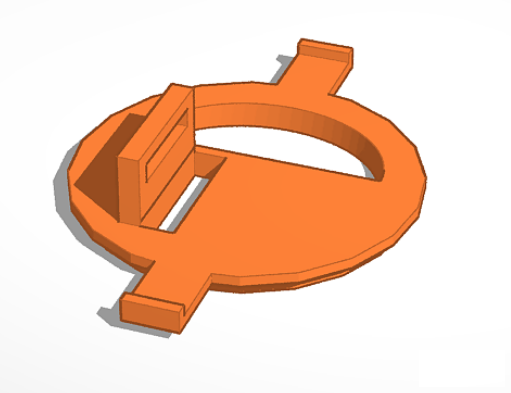
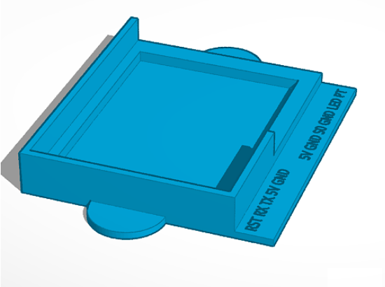
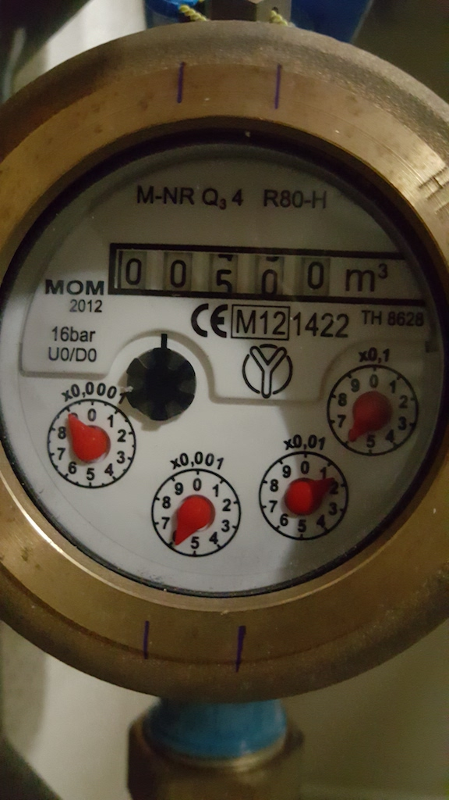
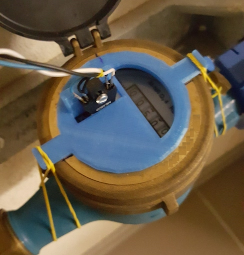
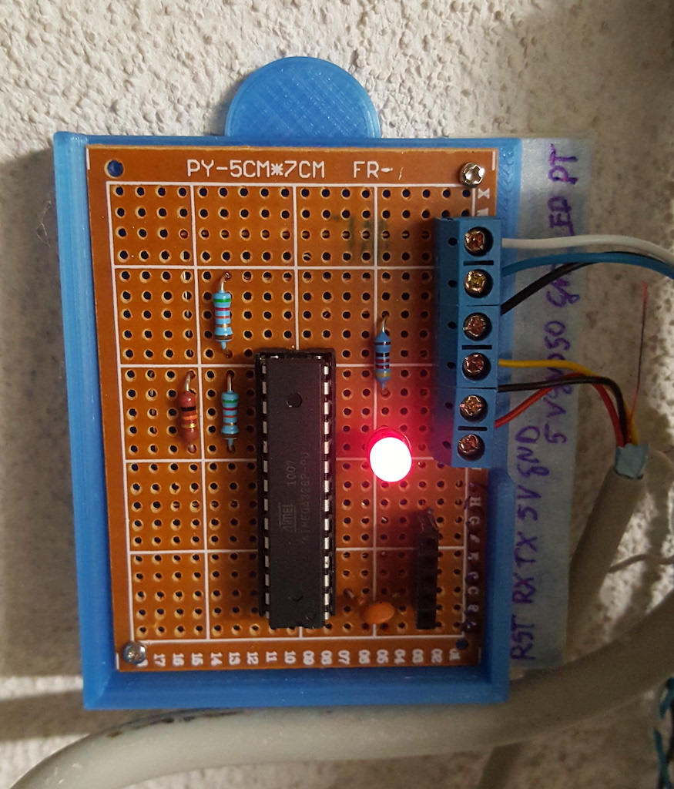
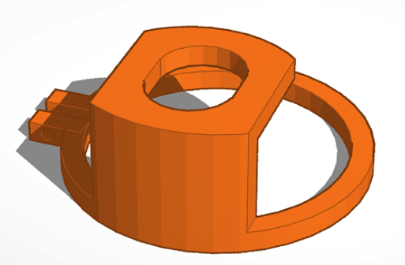
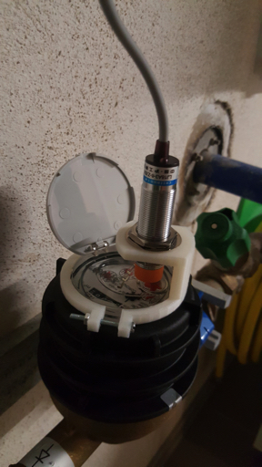

# Watermeter - S0 - Sensor

## Version 1 - with HOA1405-002 reflective sensor

*For this version the Arduino sketch `watermeter` is used.*

Sensor to create electronic impulses from a watermeter.

The HOA1405-002 reflective sensor is mounted to a watermeter, pointing to a rotating disk under water, which has alternating black and reflective areas. The signal from the photo transistor is then read via an analog input of an Atmega328P (maybe a bit oversized). Via Arduino sketch the signal is analyzed and the Atmega328P creates an impulse (5ms) for each black-reflective transition via a digital output.

I'm currently using this sensor together with this [Arduino S0 sensor](https://github.com/mtiews/arduino-s0-sensor), which feeds the data to our Smarthome.py installation. In my Smarthome installation im counting the impulses (for our watermeter 30imp/liter) and display our water consumption in a Web UI and a MagicMirror.

Sensor is based on:
* a HOA1405-002 Honeywell reflective sensor
* a watermeter mount for the sensor (STL file for 3D printing)
* an Atmega328P based circuit to read the sensor signals and generate the impulses
* an Arduino sketch and
* a simple case for the PCB (STL file for 3D printing).

## Version 2 - with LJ18A3-8-Z/BX inductive sensor

Updated version now using an inductive sensor (NPN) pulling the sensor output to ground. Change was required due to the fact, that the watermeter was changed and the old hardware solution did not work any more!

*For this version the Arduino sketch `watermeter2` is used.*

Required changes:
* sketch `watermeter2` is used
* the inductive sensor is boosted via MT3608 to about 12V, the MT3608 is connected to 5V and ground of the PCB
* the sensor output is connected to the `PT` input
* New designed watermeter mount for inductive sensor

